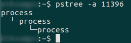

#### Summary

C program which creates ```n``` levels dependent tree of processes using ```POSIX``` system calls .

#### Compile, build and run
```make```  
compile and build executable  

```make clean```     
clean the executable

```./process```  
run

#### Info  
```c
#define SLEEP_TIME m
#define LEVELS n
```

*m* defines **spawn** and **exit** sleep time between processes .  
*n* defines number of levels, depth in dependent tree of processes .


