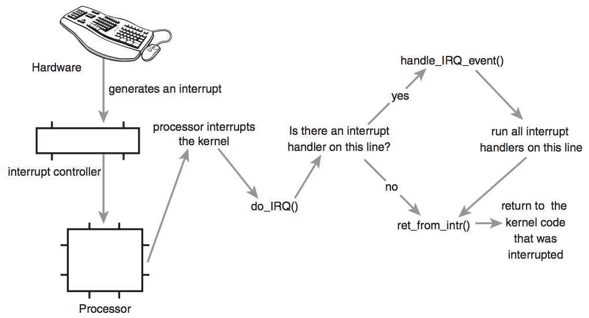

## Signals and interrupts



#### Basics

Kernel can send signal to a process. Signals can be produced from the kernel, process can send it to itself or it can be invoked by a user.

Example of a signal produced by kernel is when process is trying to reach a memory location out of
dependent address space ```SIGSEV```. Another example is when process is sending a signal, alarm to itself ```SIGALARM```. Signal which is being sent from one process to another is usually of terminating nature ( process wants to ```kill``` depending tree of processes ) . Typical user signal is **interrupt** signal. Standard for generating signal  is with the key ```DEL```, but mostly that is changed into the following combination ```ctrl+c``` .

There are many different signals in UNIX versions. For most signals ( except ```SIGKILL``` and some others ) process can control what is being happened after signal is received . It can accept built-in action  (for most) which is resulting in destroying the process. Also, it can ignore it or catch it and invoke specific function. Type of signal (```int```) is being passed into that function as the only argument and function is incapable of determining the source of signal. After return from function, process can continue from the place where interruption occurred.

**Signal** meaning for processes is analogous to the meaning of interrupt signals on CPU level. Signals can be sent arbitrarily in any moment. It also may not be handled and no one is forced to react onto it. They do not contain any information and can only be sent to a particular process/es. Usually they are not used for communication, but only for special events.

#### Types of signals

Modern implementations of ```UNIX``` are usually defining about thirty signals. Full list can be checked via [link](http://www.ucs.cam.ac.uk/docs/course-notes/unix-courses/Building/files/signals.pdf)

####Brief overview

* ```SIGINT (2)```  is being sent for which it is control terminal in the moment of the key for interrupt ```ctrl+c``` .
* ```SIGQUIT (3)``` similarly to ```SIGINT``` but is invoked from the key for finishing execution ```ctrl+x``` .
* ```SIGKILL (9)``` only safe way to destroy a process. Can not be ignored or catched .
* ```SIGALARM (14)``` is being sent when requested time of waiting for process is expired.
* ```SIGTERM (15)``` this is standard signal for destroying process. It is being used for exclusion to kill all active processes . It is expected that handler process will carefully save actual state before ending.

#### ```sigset``` and related system calls

```c
void (*sigset(int sig, void (*disp)(int)))(int);
```

specifies what will happen after the acceptance of particular signal. ```sig``` is int value of a signal . Second argument is function pointer and can be:

* ```SIG_DFL```  automatic reaction to a signal.
* ```SIG_IGN``` ignore signal.
* ```SIG_HOLD``` signal is accepted but not processed. It will be processed when definition behavior for that process is changed. Holding is allowed only for one signal for each type.
* **handler**(function pointer) how to handle signal after it is received. Can not be used for ```SIG KILL``` . Type of signal(```int```) is being passed into function.

After the return from *handler* function, process is continuing work from where it had been previously interrupted. However, if signal is being accepted at the waiting time for execution call ```read```, ```open```, ```write```, ```pause```, ```ioctl```, ```wait``` it will be interrupted by the ```EINTR``` error.

Immediately after call for the **handler** function, behavior of the incoming signal is changed in ```SIG_HOLD```. On the return from *handler* , *handler* is being restored as a function for handling functions and is releasing eventually arrived signal. That can also be done before the end of the function, with the call ```sigrelse``` which then provides the acceptance of new signal before last one is processed.

```c
//manipulating signals
int sighold(int sig);
int sigrelse(int sig);
```

Previous calls are used for security of **critical sections** within the program. ```SIG_HOLD``` is analogous to raising a priority and holding while the priority is subdued by ```SIG_RELSE```. ```SIG_RELSE```  regenerates action of the process previously specified in ```sigset``` and is releasing previously accepted and stored signal .
